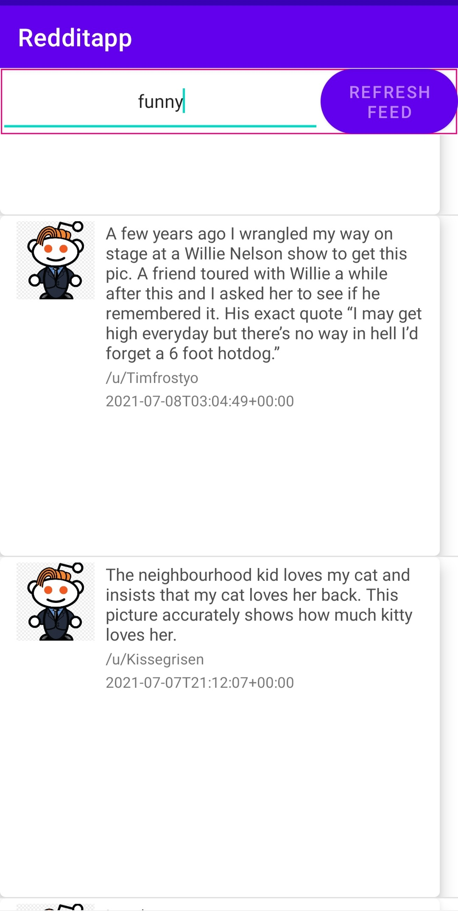
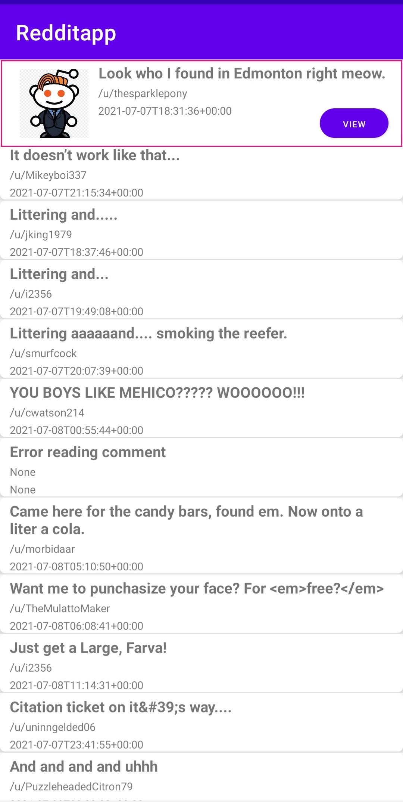

# Redditapp

## ANDROID Reddit-APPLICATION

**This application enables users to search for Different subreddits for example "Adventure","Christmas" etc.
following  KEY concepts were used to build this app.**

1.Retrieves XML data from  RSS feed and parses it using Retrofit Library(Extracting Information from website). 
2.Get REQUESTS from Retrofit Library. 
3.Card view and web view. 

***

**The application enables users to do following Tasks:-**

1.Allows user to search for different Subreddits and view post related to them. 
2.It also displays the actual thumbnail corresponding the post. 
3.Users can  also open posts and view comments from different authors which are actiually posted underneath those posts in the website. 
4.It furthermore enables users to view the post in webview inside the application. 

**FEW IMAGES OF THE APPLICATION**

